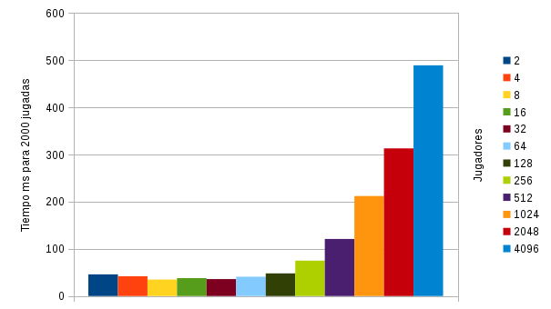

# Actividad 4

Grupo CDI_4

> Víctor Malvárez Filgueira

> Martín Molina Álvarez

## Respuestas

**NOTA:** Los ejercicios marcados con un guión indican que no tienen una respuesta en forma de texto, sino que únicamente se entrega código.

### 1
-

### 2
-

### 3
-

### 4
El método `notifyAll` notifica a todos los hilos que están esperando (han hecho `wait`) al objeto de dicho método. El método `notify` notifica únicamente a uno de los hilos que están esperando (no se sabe cuál, uno de ellos). En nuestro caso resulta conveniente utilizar el método `notify` ya que en cada instante solo un hilo va a estar a estar esperando que se despierte el propio objeto.

### 5
-

### 6
-

### 7
?

### 8


- El resultado debería ser constante ya que la pelota en cada momento solo puede estar en un jugador entonces es independiente del número de jugadores.
- Las mediciones dicen que cuantos más hilos estén en funcionamiento (más jugadores) más lento es el programa.
- El método más eficiente es con un número de jugadores entre 2-64 jugadores cuyos tiempos son muy similares (entre 35ms y 41ms).

### 9
Si se interrupme un hilo el funcionamiento del programa no cambia. En cada jugador cuando se invoca el `wait()` se hace dentro de un bucle y un bloque `try catch` que comprueba si "sale del wait" de forma normal o por una interrupción. Para discernir si ha salido de forma normal utiliza como bandera la pelota. Si al salir del wait no tiene la pelota un bucle hace que vuelva a entrar en el wait. Código de ejemplo:

```java
synchronized(this){
	while(!tienePelota() && !partidaFinalizada){
		this.esperando = true;
		try {
			this.wait();
		} catch(InterruptedException e){};
		this.esperando = false;
	}
}
```

### 10
Tuvimos que modificar este código:

```java

System.out.println("El hilo " + id + " lanza la pelota");
			
Actividad4.pasarSiguienteJugador();//pasa la pelota al siguiente jugador, en este caso a si mismo
pelota=null;//se pasó la pelota a si mismo pero después la quitó entonces nunca sale del bucle por motivo de la expresión !tienePelota()

synchronized(this){
	while(!tienePelota() && !partidaFinalizada){
		this.esperando = true;
		try {
			this.wait();
		} catch(InterruptedException e){};
		this.esperando = false;
	}
}
```

por este:

```java

System.out.println("El hilo " + id + " lanza la pelota");

pelota=null; //A: quita la pelota antes de pasarla
Actividad4.pasarSiguienteJugador();//B: pasa la pelota al siguiente jugador, en este caso a si mismo

synchronized(this){
	//no entra en el bucle por que en B: ha recibido la pelota (único jugador)
	while(!tienePelota() && !partidaFinalizada){
		this.esperando = true;
		try {
			this.wait();
		} catch(InterruptedException e){};
		this.esperando = false;
	}
}
```


